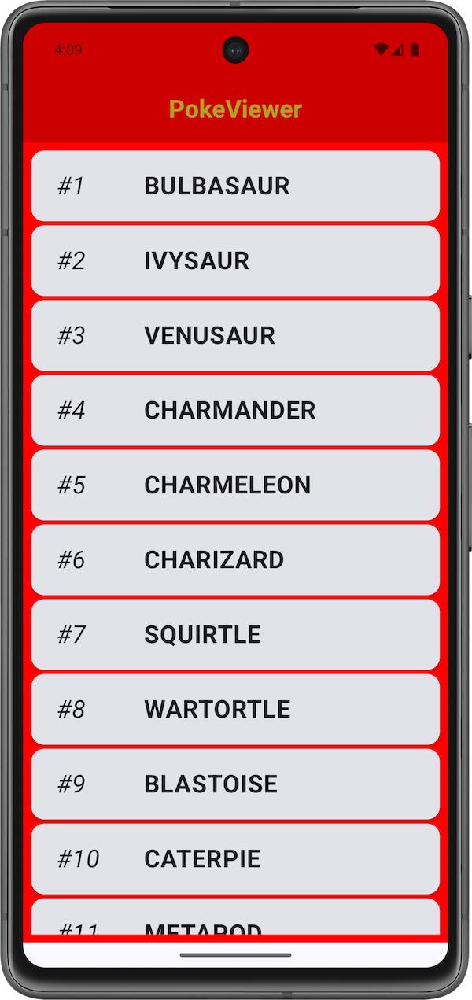

# PokeViewer
Simple Android app to view a list of Pokemon, Built with modern tooling and practices

## Demo
</img>
</img>

## Architecture & Key Components
- UI/UX: [Jetpack Compose](https://developer.android.com/compose), [Paging 3](https://developer.android.com/topic/libraries/architecture/paging/v3-overview)
- MVVM
- Depedency Injection: [Hilt](https://dagger.dev/hilt/)
- Repository Pattern
- Network Layer: [Retrofit](https://square.github.io/retrofit/)
- Image loading: [Coil](https://coil-kt.github.io/coil/)
- Pokemon data from: [PokeAPI](https://github.com/PokeAPI/pokeapi)

## Build tools & versions used
- Macbook with an M-series chip
- Android Studio Meerkat | 2024.3.1 Patch 2
- Library versions used as of July 2025